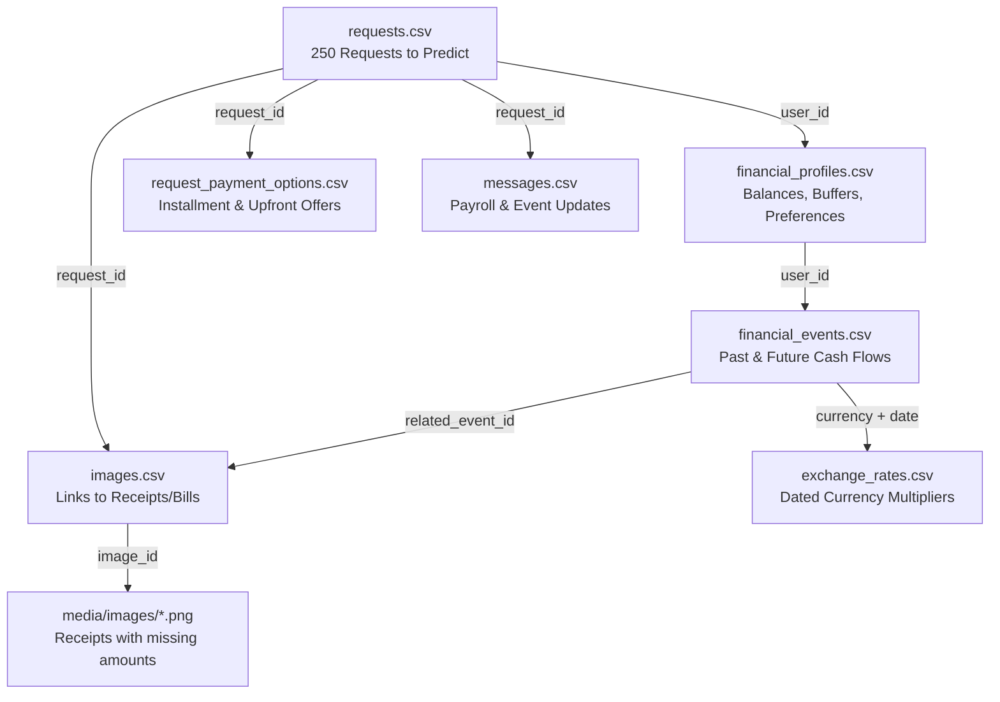
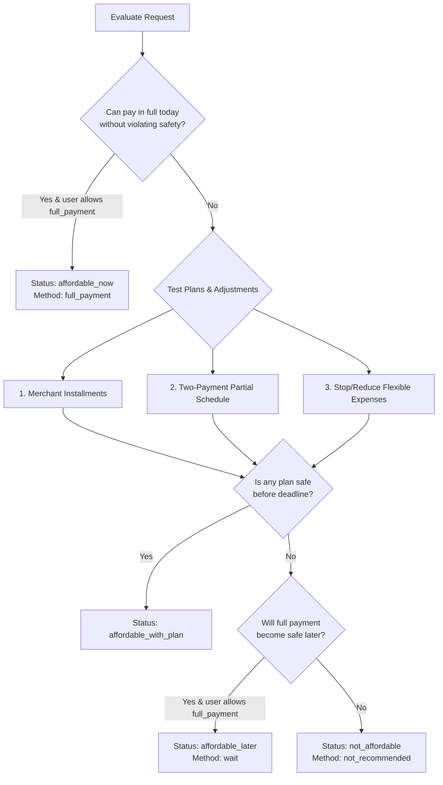

# 📘 Buy or Wait? — Master Problem & Implementation Guide
> **HackerRank Orchestrate (September 2026)**  
> *A complete, Notion-style visual breakdown of the challenge, data pipeline, financial decision engine, and submission checklist.*

---

## 🧭 Table of Contents
1. [🎯 The Gist: What Are We Actually Building?](#1--the-gist-what-are-we-actually-building)
2. [🗂️ The Data Ecosystem (How Files Connect)](#2-%EF%B8%8F-the-data-ecosystem-how-files-connect)
3. [🧠 The Financial Decision Brain (The 90-Day Simulation)](#3--the-financial-decision-brain-the-90-day-simulation)
4. [💳 Payment Methods & Ranking Logic](#4--payment-methods--ranking-logic)
5. [📋 The 8 Required Output Columns](#5--the-8-required-output-columns)
6. [⚠️ Top Traps & Hidden Edge Cases](#6-%EF%B8%8F-top-traps--hidden-edge-cases)
7. [🚀 Step-by-Step Build Roadmap](#7--step-by-step-build-roadmap)

---

## 1. 🎯 The Gist: What Are We Actually Building?

Imagine an intelligent personal financial copilot inside your banking app. 

A user asks:  
> *"Can I afford this laptop for ZAR 25,256?"* or *"Can I book this flight for IDR 46,000,000?"*

A naive app simply checks: `current_balance >= cost`. **This is dangerous.** A user might have \$5,000 today, but has rent of \$3,000 due in 4 days, car insurance due next week, and a minimum balance buffer of \$1,500 they never want to breach.

### Your Goal:
For every request in `dataset/requests.csv` (250 total requests), determine:
1. **How much can they safely spend today?** (`amount_safe_to_pay`)
2. **What is their status?** (`affordable_now`, `affordable_with_plan`, `affordable_later`, or `not_affordable`)
3. **What payment method should they use?** (`full_payment`, `partial_payment`, `installments`, `wait`, or `not_recommended`)
4. **What exact schedule should they follow?** (`payment_plan`)
5. **If they can't pay in full today, when is the earliest safe date?** (`earliest_date_for_full_payment`)
6. **Do they need to cut flexible subscriptions to afford it?** (`spending_changes_needed`)
7. **Why?** A clear, concise explanation backed by their financial facts (`decision_explanation`).

---

## 2. 🗂️ The Data Ecosystem (How Files Connect)

All participant-facing data lives inside `dataset/`. Here is how the 8 files connect:



### File Breakdown:

| File | What's Inside | Crucial Things to Watch |
| :--- | :--- | :--- |
| **`requests.csv`** | 250 requests to evaluate | Has `request_date`, `requested_amount`, `desired_completion_date`, `allows_partial_payment`. |
| **`sample_requests.csv`** | 25 completed reference cases | Ground-truth benchmark to validate our simulation against! |
| **`financial_profiles.csv`** | User's balance, buffer, preferences | `minimum_balance_to_keep` (safety floor), protected categories, categories user is willing to reduce/stop, payment methods allowed, `max_installment_months`. |
| **`financial_events.csv`** | All transactions & recurring debits | Rent, loans, utilities, salaries. Statuses: `settled`, `pending`, `scheduled`. |
| **`request_payment_options.csv`** | Merchant payment plans | Available installment plans: `payment_amount`, `number_of_payments`, `financing_fee`, `frequency_days`. |
| **`exchange_rates.csv`** | Fixed conversion rates | Used whenever an event is in a different currency from the user's `home_currency`. |
| **`messages.csv`** | Text updates | Employer notifications (e.g. salary raises, bonuses delayed, payment adjustments). |
| **`images.csv` & `media/`** | 17 document images | **Crucial:** If an event in `financial_events.csv` has an empty `amount`, find its `event_id` in `images.csv` and extract the amount from `media/images/<image_id>.png`! |

---

## 3. 🧠 The Financial Decision Brain (The 90-Day Simulation)

Everything hinges on a **90-Day Forward Cash Flow Projection**:

```text
Day 0 (request_date) ---------------------------------------------> Day 90
[Current Balance]  - [Pending Debits]  +/- [Daily Projected Cash Flows]
   └── MUST ALWAYS REMAIN >= minimum_balance_to_keep
```

### The Strict Accounting Rules:
1. **Pending Debits**: Must be subtracted/reserved immediately.
2. **Pending Credits & Bonuses**: **NEVER count them** until they are settled! (e.g. pending lottery, pending bonuses, investment gains are ignored).
3. **Salary**: Count confirmed salary on its scheduled settlement date.
4. **Recurring Debits**: Project recurring rent, utilities, groceries, and debt repayments forward across the 90 days.
5. **Safety Invariant**:
   $$	ext{Balance}(t) \ge 	ext{minimum\_balance\_to\_keep} \quad orall t \in [0, 90]$$

---

## 4. 💳 Payment Methods & Ranking Logic

For each request, the agent tests all possible strategies in this order:



### Tie-Breaker Ranking (When Multiple Plans are Safe):
1. Completes by `desired_completion_date`.
2. Requires **no spending changes** (`spending_changes_needed: none`).
3. **Minimizes total payment cost** (lowest financing fee).
4. Starts earlier.
5. Uses fewer payments.
6. Lowest `payment_option_id` as final tie-breaker.

---

## 5. 📋 The 8 Required Output Columns

`output.csv` must have exactly these 8 columns in this order:

| # | Column | Allowed / Expected Format | Example |
|---|---|---|---|
| 1 | `request_id` | Match `requests.csv` | `request_01` |
| 2 | `amount_safe_to_pay` | Number between `0` and `requested_amount` | `25256` or `17229139.2` |
| 3 | `affordability_status` | `affordable_now` \| `affordable_with_plan` \| `affordable_later` \| `not_affordable` | `affordable_now` |
| 4 | `recommended_payment_method` | `full_payment` \| `partial_payment` \| `installments` \| `wait` \| `not_recommended` | `full_payment` |
| 5 | `payment_plan` | `YYYY-MM-DD:amount\|...` or `none` | `2024-03-03:25256` |
| 6 | `earliest_date_for_full_payment` | `YYYY-MM-DD` (blank if never safe in 90 days) | `2024-03-03` |
| 7 | `spending_changes_needed` | `stop:<id>\|reduce_to:<id>:<amt>` or `none` | `stop:event_476` |
| 8 | `decision_explanation` | Concise 1-2 sentence grounded justification | `Pay ZAR 25,256 today. This leaves at least ZAR 18,000 available.` |

---

## 6. ⚠️ Top Traps & Hidden Edge Cases

- 🔍 **Image OCR / Missing Amounts**:
  Some events in `financial_events.csv` have blank amounts. We must extract the exact amount from the corresponding image in `dataset/media/images/`.
- ✉️ **Message Context Overrides**:
  `messages.csv` contains employer messages like: *"Your monthly pay is reduced to EUR 1037.52"* or *"Quarterly bonus is delayed"*. The simulation must apply these updates to the events!
- 💱 **Currency Conversions**:
  Events denominated in foreign currencies must be converted to the user's `home_currency` using the exact rate from `exchange_rates.csv` for that settlement date.
- 🛑 **Partial Payment Rule**:
  Requires `allows_partial_payment == true`, exactly 2 payments: `amount_safe_to_pay` on `request_date` and the remainder on `earliest_date_for_full_payment`.
- ✂️ **Spending Change Constraints**:
  Up to 3 changes maximum. Can **only** target categories the user explicitly permits in `financial_profiles.csv` (`expense_categories_user_is_willing_to_reduce` or `stop`). Never modify protected expenses!

---

## 7. 🚀 Step-by-Step Build Roadmap

1. **Phase 1: Ingestion & Multimodal Preprocessing**
   - Parse profiles, events, exchange rates, payment options, and messages.
   - Extract missing event amounts from the 17 images in `dataset/media/images/`.
2. **Phase 2: 90-Day Simulation Engine**
   - Build daily cash balance projector.
   - Calculate exact `amount_safe_to_pay` and `earliest_date_for_full_payment`.
3. **Phase 3: Decision Policy & Plan Ranking**
   - Test full payment, available installment options, partial payment, and spending cuts.
   - Pick the optimal safe plan based on the 6 ranking criteria.
4. **Phase 4: Benchmark Validation**
   - Run our agent against the 25 cases in `sample_requests.csv` to verify 100% agreement with expected labels.
5. **Phase 5: Full Run & Packaging**
   - Generate root `output.csv` for all 250 requests.
   - Build `evaluation/usage_report.md` and bundle `code.zip`.
